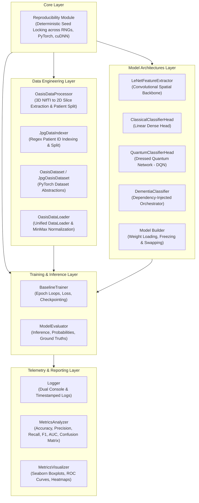
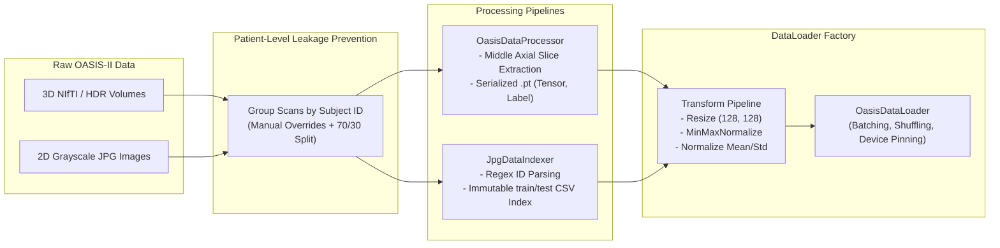
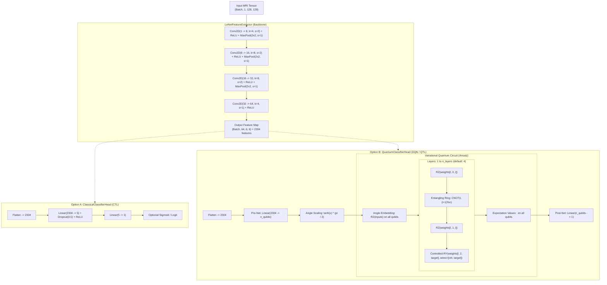
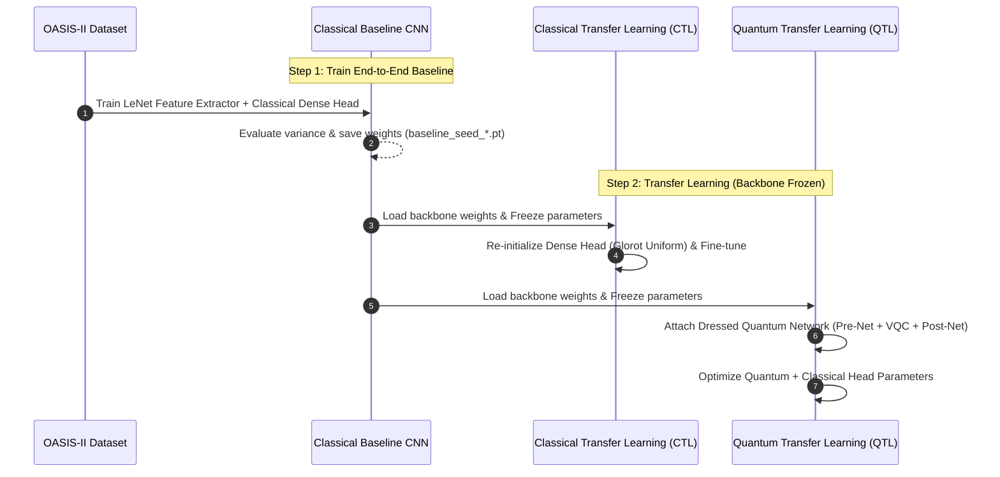
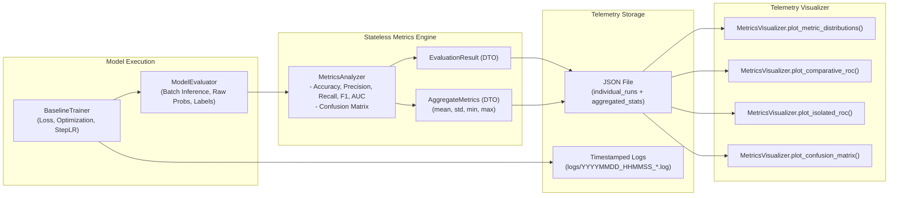

# System Architecture: Dementia-Boost QTL Framework

## 1. Architectural Overview

The `dementia-boost` framework is designed around clean Software Engineering and MLOps principles, avoiding monolithic scripts and unstructured notebooks.

It enforces strict separation of concerns across data processing, modular neural/quantum architectures, decoupled training loops, and deterministic telemetry.

The system is partitioned into five main pillars:



---

## 2. Component Breakdown

### 2.1 Core Layer (`src/dementia_boost/core/`)

- **`reproducibility.py`**: Provides `set_seed(seed: int)`, which enforces deterministic execution across Python's `random`, `numpy`, PyTorch CPU/CUDA engines, and locks `torch.backends.cudnn.deterministic = True` with `benchmark = False`.

### 2.2 Data Engineering Layer (`src/dementia_boost/data/`)

The data pipeline eliminates patient-level data leakage across longitudinal MRI sessions:

- **`data_processor.py` (`OasisDataProcessor`)**: Streams raw 3D NIfTI/HDR volumes, groups visits by unique `Subject ID`, isolates subjects into train/test cohorts, extracts the central 2D axial slice, and serializes processed tensors to disk (`.pt`).

- **`jpg_indexer.py` (`JpgDataIndexer`)**: Uses regular expressions to extract patient IDs from 2D image filenames (`oas2?_\d+`), enforces patient-level train/test isolation, and generates immutable CSV index files (`train_jpg_index.csv`, `test_jpg_index.csv`).

- **`dataset.py`**:

  - `OasisDataset`: Loads serialized `.pt` image-label pairs.
  - `JpgOasisDataset`: Dynamically loads JPGs from disk via PIL, converting them to grayscale float tensors.

- **`data_loader.py`**:
  - `OasisDataLoader`: Unified factory creating PyTorch `DataLoader` instances for both `nifti` and `jpg` modalities.
  - `MinMaxNormalize`: Custom transform performing per-sample dynamic range squashing into `[0.0, 1.0]`.



---

## 3. Model Architecture & Hybrid Dressed Quantum Network (DQN)

The model ecosystem uses **Dependency Injection** via the `DementiaClassifier` container. A common spatial backbone (`LeNetFeatureExtractor`) can be dynamically paired with either a classical dense head or a variational quantum head.



### 3.1 Mathematical Formulation of the Dressed Quantum Network (DQN)

1. **Classical Feature Extraction**:
   $$z_{\text{raw}} = f_{\text{backbone}}(x) \in \mathbb{R}^{2304}$$

2. **Pre-Net Dimensionality Reduction & Angle Mapping**:
   $$\tilde{z} = \tanh(W_{\text{pre}} z_{\text{raw}} + b_{\text{pre}}) \cdot \frac{\pi}{2} \in \left[-\frac{\pi}{2}, \frac{\pi}{2}\right]^{n_{\text{qubits}}}$$

3. **Quantum Encoding & Parameterized Evolution**:
   $$|\psi(\tilde{z})\rangle = \bigotimes_{i=1}^{n_{\text{qubits}}} R_z(\tilde{z}_i) |0\rangle^{\otimes n_{\text{qubits}}}$$
   $$|\phi_\theta(\tilde{z})\rangle = \prod_{l=1}^{L} \left[ U_{\text{CRY}}(\theta_{l,2}) U_{R_z}(\theta_{l,1}) U_{\text{CNOT}} U_{R_z}(\theta_{l,0}) \right] |\psi(\tilde{z})\rangle$$

4. **Quantum Measurement (POVM)**:
   $$\langle Z_i \rangle = \langle \phi_\theta(\tilde{z}) | \sigma_z^{(i)} | \phi_\theta(\tilde{z}) \rangle \in [-1, 1]$$

5. **Post-Net Classification Logit**:
   $$\hat{y}_{\text{logit}} = W_{\text{post}} \begin{bmatrix} \langle Z_1 \rangle \\ \vdots \\ \langle Z_n \rangle \end{bmatrix} + b_{\text{post}}$$

---

## 4. Transfer Learning Pipeline

The project supports three training modes orchestrated through `builder.py`:



---

## 5. Telemetry, Metric Aggregation & Evaluation Flow

Training and evaluation lifecycles are decoupled from serialization and plotting:



---

## 6. Directory and Module Structure

```
dementia-boost/
├── docs/                                  # Research documentation and specifications
│   ├── architecture.md                    # System architecture and technical overview
│   ├── qtl_research_goals_activities.md   # 12-month research schedule and activities
│   └── qtl_to_boost_dementia_detection.md # Foundational paper (Bhowmik et al. 2025)
├── src/
│   └── dementia_boost/
│       ├── core/                          # Reproducibility & runtime utilities
│       │   └── reproducibility.py         # Deterministic seed locker
│       ├── data/                          # Data processing, indexing & loaders
│       │   ├── data_loader.py             # Unified DataLoader & normalization transforms
│       │   ├── data_processor.py          # NIfTI 3D/2D ETL & patient-split orchestrator
│       │   ├── dataset.py                 # OasisDataset & JpgOasisDataset classes
│       │   └── jpg_indexer.py             # Regex patient ID parser & CSV indexer
│       ├── models/                        # Neural & Quantum network architectures
│       │   ├── builder.py                 # Factory functions for CTL and QTL models
│       │   ├── classical_cnn/             # Classical CNN backbone and dense heads
│       │   │   ├── classifier.py          # DementiaClassifier orchestrator
│       │   │   ├── feature_extractor.py   # LeNetFeatureExtractor backbone
│       │   │   └── heads.py               # ClassicalClassifierHead
│       │   └── quantum_cnn/               # Quantum neural network components
│       │       ├── circuit.py             # PennyLane QNode and custom Ansatz definition
│       │       └── heads.py               # QuantumClassifierHead (DQN)
│       ├── training/                      # Training and inference lifecycle runners
│       │   ├── evaluator.py               # Weight loading and inference predictor
│       │   └── trainer.py                 # Training loop with validation & checkpointing
│       └── telemetry/                     # Metrics calculation, serialization & plotting
│           ├── logger.py                  # Standardized dual console/file logger
│           ├── metrics.py                 # MetricsAnalyzer and DTO definitions
│           └── visualizer.py              # Publication-ready Seaborn/Matplotlib plots
├── scripts/                               # CLI entry-points for training and evaluation
│   ├── cherrypicked_baseline/             # Reference baseline execution scripts
│   ├── jpg/                               # Training and evaluation scripts for JPG pipeline
│   ├── metrics/                           # Quantitative comparison and delta report generators
│   └── qtl/                               # Multi-seed QTL training scripts
└── tests/                                 # Unit and integration test suites
```
