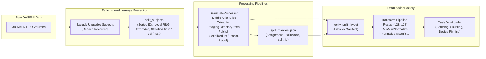
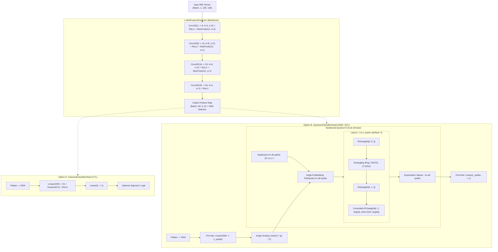
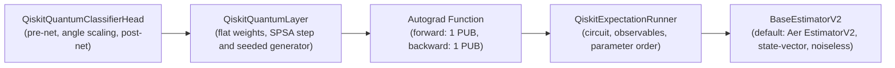
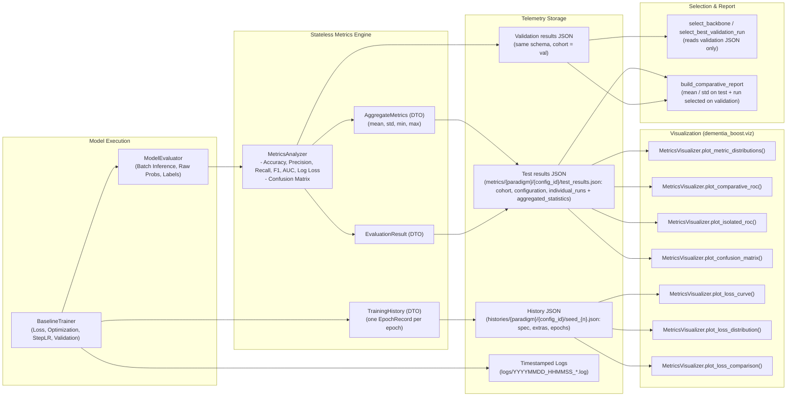

# System Architecture: Dementia-Boost QTL Framework

## 1. Architectural Overview

The `dementia-boost` framework is designed around clean Software Engineering and MLOps principles, avoiding monolithic scripts and unstructured notebooks.

It enforces strict separation of concerns across data processing, modular neural/quantum architectures, decoupled training loops, and deterministic telemetry.

The system is partitioned into six main pillars:


```mermaid
flowchart TD
    subgraph Core ["Core Layer"]
        REP["Reproducibility Module<br/>(Deterministic Seed Locking across RNGs, PyTorch, cuDNN)"]
        IDN["RunSpec & Hash IDs<br/>(Run Identity: config_id, run_id, Label)"]
        LAY["ResultsLayout<br/>(Where Every Artifact of a Run Lives)"]
    end

    subgraph Data ["Data Engineering Layer"]
        ETL_NIFTI["OasisDataProcessor<br/>(3D NIfTI to 2D Slice Extraction, Deterministic Patient Split & Split Manifest)"]
        DS["OasisDataset<br/>(PyTorch Dataset Abstraction)"]
        DL["OasisDataLoader<br/>(Cohort DataLoader Factory, Manifest Check & MinMax Normalization)"]
        CACHE["FeatureCacheManager / CachedEmbeddingDataset<br/>(In-Memory Feature Embeddings & I/O-Free Streaming)"]
    end

    subgraph Models ["Model Architectures Layer"]
        FE["LeNetFeatureExtractor<br/>(Convolutional Spatial Backbone)"]
        CH["ClassicalClassifierHead<br/>(Linear Dense Head)"]
        QH["QuantumClassifierHead<br/>(Dressed Quantum Network - DQN)"]
        QKH["QiskitQuantumClassifierHead<br/>(DQN on Qiskit Primitives V2)"]
        DC["DementiaClassifier<br/>(Dependency-Injected Orchestrator)"]
        BUILDER["Model Builder<br/>(Weight Loading, Freezing & Swapping)"]
    end

    subgraph Training ["Training & Inference Layer"]
        TR["BaselineTrainer<br/>(Epoch Loops, Loss, Validation, Checkpointing, History Recording)"]
        EV["ModelEvaluator<br/>(Inference, Probabilities, Ground Truths)"]
        CEV["checkpoint_evaluation<br/>(Each Checkpoint on Validation and Test Cohorts)"]
    end

    subgraph Telemetry ["Telemetry & Reporting Layer"]
        LOG["Logger<br/>(Dual Console & Timestamped Logs)"]
        MET["MetricsAnalyzer<br/>(Accuracy, Precision, Recall, F1, AUC, Log Loss, Confusion Matrix, Training History DTOs)"]
        SEL["Selection & Report<br/>(Model Selection on Validation, Comparative Report)"]
        LST["Run Listing & Lookup Table<br/>(Runs Found from Histories, Hash to Configuration and Seed)"]
    end

    subgraph Viz ["Visualization Layer"]
        VIS["MetricsVisualizer<br/>(Seaborn Boxplots, ROC Curves, Heatmaps, Loss Curves)"]
        RPL["run_plots<br/>(Plots per Configuration, Run Highlighted on Validation)"]
    end

    Core --> Data
    Core --> Models
    Core --> Training
    Data --> Training
    Models --> Training
    Training --> Telemetry
    Telemetry --> Viz
```

---

## 2. Component Breakdown

### 2.1 Core Layer (`src/dementia_boost/core/`)

- **`reproducibility.py`**: Provides `set_seed(seed: int)`, which enforces deterministic execution across Python's `random`, `numpy`, PyTorch CPU/CUDA engines, and locks `torch.backends.cudnn.deterministic = True` with `benchmark = False`.

- **`identity.py`**: The typed run specification `RunSpec`, the `Paradigm` enumeration, and the hash IDs and label derived from a spec (see 2.1.1).

- **`layout.py`**: `ResultsLayout`, the only code that knows where the artifacts of a run are written and read (see 2.1.1).

#### 2.1.1 Run identity

A run used to be identified by its name (`qtl_seed_3`), which said nothing about its qubits, layers, learning rate, backbone, or split, so two different configurations collided on disk. Identity is now split into three separate things:

- **The specification** (`RunSpec`, a frozen dataclass): the paradigm, the ansatz, qubits and layers, the learning rates, the `StepLR` settings, epochs, batch size, the gradient method, the `backbone_id`, the `split_id`, and the `seed`. Fields that do not apply to a paradigm are `None`, and each paradigm validates that its required fields are set (a baseline has no quantum fields and no backbone, a head needs its backbone). The spec is stored in every training history, so it is the source of truth for what a run was.
- **The IDs** (opaque hashes of the spec): `config_id` hashes every field except the seed, so all seeds of one configuration share it; `run_id` hashes every field. Both are the first 12 hex characters of a SHA-256 over the canonical JSON of the spec (sorted keys, `None` fields dropped, so adding a new optional field later does not change existing IDs). The `backbone_id` of a head is the `run_id` of the baseline it was built on, which pins its checkpoint and, through it, its split. `split_id` uses the same hash helper.
- **The label** (output only): a readable rendering such as `qtl | paper | 6q x 4L | lr 0.0001 | seed 3`, for plots and logs. Nothing parses it.

No code recovers configuration from a file name. The trainer refuses a spec that disagrees with its optimizer's learning rate, its loader's batch size, or its `StepLR` settings, so an ID never names a configuration that did not run. Details that do not define a run (devices, evaluation cadence) are stored as non-hashed extras in the history.

`ResultsLayout` turns a spec into paths under `data/results`:

```
checkpoints/<paradigm>/<config_id>/seed_<n>.pt
histories/<paradigm>/<config_id>/seed_<n>.json     the history, which carries the full spec
histories/<paradigm>/<config_id>/config.json        the configuration (spec without the seed, label)
metrics/<paradigm>/<config_id>/{val,test}_results.json
plots/<paradigm>/<config_id>/
```

Seeds of one configuration share a directory, and a changed configuration gets its own, so runs never collide and the "skip a finished run" check (`ResultsLayout.is_done`) cannot skip a run whose configuration changed. `config.json` refuses to be overwritten by a different spec (a hash collision is detected, not merged). Runs are found by reading the histories (`telemetry/run_listing.py`), and a history that is not at the path its own spec gives is refused.

Because IDs are hashes, `uv run scripts/list_runs.py` gives the lookup: one row per configuration (label, split, seeds), one row per run with `--runs`, the full spec and file paths of any ID prefix with `--find`, and a CSV with `--csv`. It is rebuilt from the histories on every call.

### 2.2 Data Engineering Layer (`src/dementia_boost/data/`)

The data pipeline eliminates patient-level data leakage across longitudinal MRI sessions. Subjects (patients) are split into three cohorts, and every visit of a subject stays in that subject's cohort:

- **`train`** fits the models.
- **`val`** is evaluated every epoch for the loss curves, and is the only cohort used to choose between models (for example the backbone for transfer learning).
- **`test`** is never seen during training or selection. It is evaluated afterwards, once per saved checkpoint, and only reported.

The components that enforce this:

- **`subject_ids.py`**: One canonical subject ID form (`OAS2_NNNN`, uppercase, trimmed), kept apart from the visit ID (`OAS2_NNNN_MRk`, one exam of a subject). It maps diagnostic groups to labels case-insensitively, raises on a subject with conflicting groups, and validates the manual train and test overrides (unknown IDs, visit IDs, and IDs in both lists are rejected).

- **`split.py` (`split_subjects`)**: A pure function from labelled subjects, ratios, a seed, and the overrides to three sorted cohorts. It sorts the IDs before drawing and uses its own `random.Random(seed)`, so the same input gives the same split in every process and on every machine, and it never reads or reseeds global RNG state. Order of operations: overrides are fixed first, then the test cohort is drawn (default 30%), then the validation cohort from the remaining subjects that were not forced into train (default 20%). Both draws are stratified by class, so every cohort keeps the class balance of the whole set. It raises if a cohort would lack one of the classes.

- **`data_processor.py` (`OasisDataProcessor`)**: Scans the raw volumes (header only, checking that each is 3D), excludes the subjects that cannot be used, splits the rest with `split_subjects`, extracts the central 2D axial slice of every volume, and serializes the tensors (`.pt`). Subjects left out are recorded with a reason: no raw data, no row in the metadata CSV, no readable 3D volume, or the `Converted` group. The whole split is first written to a staging directory; only when every file was written does the processor replace the `.pt` files of `train/`, `val/`, and `test/` (other files in those directories are never touched) and write the manifest. An interrupted run therefore leaves the previous split intact. Running the ETL again is safe, and the same arguments reproduce the same files byte for byte.

- **`split_manifest.py`**: Writes and reads `split_manifest.json` (atomically, without timestamps). It records per subject its cohort, label, and file count; the excluded subjects with reasons; the skipped raw files; the seed, ratios, and manual overrides; and per cohort the subject count, file count, and class balance. `split_id` is a short hash of the subject-to-cohort assignment only, so it changes when and only when a subject changes cohort.

- **`split_guards.py` (`verify_split_layout`)**: Compares the cohort directories with the manifest and raises one `SplitIntegrityError` naming the offending subjects if a subject is in two cohorts, a file sits in a cohort the manifest does not assign to its subject, a subject has more or fewer files than recorded, or a cohort holds a single class. The processor runs it after writing, and the data loader runs it before returning any loader.

- **`cohort_audit.py`**: Read-only helpers that list the subjects of each cohort directory from the file names and report subjects shared between cohorts. `scripts/audit_cohorts.py` prints that report and exits with status 1 on a leak.

- **`dataset.py`**:

  - `OasisDataset`: Loads serialized `.pt` image-label pairs, listing the files in sorted order so sample order does not depend on the filesystem.

- **`data_loader.py`**:
  - `OasisDataLoader`: Factory creating PyTorch `DataLoader` instances over the processed NIfTI slice tensors for one cohort (`get_data_loader("train" | "val" | "test")`). Only the training loader shuffles. It verifies the layout against the manifest before returning a loader.
  - `MinMaxNormalize`: Custom transform performing per-sample dynamic range squashing into `[0.0, 1.0]`.

- **`embedding_cache.py`**:
  - `CachedEmbeddingDataset`: High-throughput in-memory dataset storing pre-extracted feature tensors and diagnostic labels.
  - `FeatureCacheManager`: Static manager for one-time backbone feature extraction, disk cache serialization, and fast in-memory `DataLoader` generation for transfer learning.


```mermaid
flowchart LR
    subgraph RawData ["Raw OASIS-II Data"]
        NIFTI_FILES["3D NIfTI / HDR Volumes"]
    end

    subgraph SplitLogic ["Patient-Level Leakage Prevention"]
        EXCLUDE["Exclude Unusable Subjects<br/>(Reason Recorded)"]
        SUBJ_SPLIT["split_subjects<br/>(Sorted IDs, Local RNG, Overrides, Stratified train / val / test)"]
    end

    subgraph Pipelines ["Processing Pipelines"]
        NIFTI_PIPE["OasisDataProcessor<br/>- Middle Axial Slice Extraction<br/>- Staging Directory, then Publish<br/>- Serialized .pt (Tensor, Label)"]
        MANIFEST["split_manifest.json<br/>(Assignment, Exclusions, split_id)"]
    end

    subgraph Loaders ["DataLoader Factory"]
        GUARD["verify_split_layout<br/>(Files vs Manifest)"]
        TRANSFORMS["Transform Pipeline<br/>- Resize (128, 128)<br/>- MinMaxNormalize<br/>- Normalize Mean/Std"]
        LOADER["OasisDataLoader<br/>(Batching, Shuffling, Device Pinning)"]
    end

    NIFTI_FILES --> EXCLUDE
    EXCLUDE --> SUBJ_SPLIT
    SUBJ_SPLIT --> NIFTI_PIPE
    NIFTI_PIPE --> MANIFEST
    NIFTI_PIPE --> GUARD
    MANIFEST --> GUARD
    GUARD --> TRANSFORMS
    TRANSFORMS --> LOADER
```

---

## 3. Model Architecture & Hybrid Dressed Quantum Network (DQN)

The model ecosystem uses **Dependency Injection** via the `DementiaClassifier` container. A common spatial backbone (`LeNetFeatureExtractor`) can be dynamically paired with either a classical dense head or a variational quantum head.


```mermaid
flowchart TD
    INPUT["Input MRI Tensor<br/>(Batch, 1, 128, 128)"]

    subgraph Backbone ["LeNetFeatureExtractor (Backbone)"]
        C1["Conv2D(1 -> 8, k=4, s=2) + ReLU + MaxPool(2x2, s=1)"]
        C2["Conv2D(8 -> 16, k=8, s=2) + ReLU + MaxPool(2x2, s=1)"]
        C3["Conv2D(16 -> 32, k=8, s=2) + ReLU + MaxPool(2x2, s=1)"]
        C4["Conv2D(32 -> 64, k=4, s=1) + ReLU"]
        FMAP["Output Feature Map<br/>(Batch, 64, 6, 6) = 2304 features"]
    end

    INPUT --> C1 --> C2 --> C3 --> C4 --> FMAP

    subgraph ClassicalHead ["Option A: ClassicalClassifierHead (CTL)"]
        FLAT_C["Flatten -> 2304"]
        D1["Linear(2304 -> 5) + Dropout(0.5) + ReLU"]
        D2["Linear(5 -> 1)"]
        SIG["Optional Sigmoid / Logit"]
        FLAT_C --> D1 --> D2 --> SIG
    end

    subgraph QuantumHead ["Option B: QuantumClassifierHead (DQN / QTL)"]
        FLAT_Q["Flatten -> 2304"]
        PRE["Pre-Net: Linear(2304 -> n_qubits)"]
        SCALE["Angle Scaling: tanh(x) * (pi / 2)"]

        subgraph VQC ["Variational Quantum Circuit (Ansatz)"]
            HAD["Hadamard on all qubits: |0> to |+>"]
            ENC["Angle Embedding: RZ(inputs) on all qubits"]
            subgraph Repetitions ["Layers: 1 to n_layers (default: 4)"]
                RZ1["RZ(weights[l, 0, i])"]
                CNOT["Entangling Ring: CNOT(i, (i+1)%n)"]
                RZ2["RZ(weights[l, 1, i])"]
                CRY["Controlled-RY(weights[l, 2, target], wires=[ctrl, target])"]
                RZ1 --> CNOT --> RZ2 --> CRY
            end
            MEAS["Expectation Values: <PauliZ> on all qubits"]
            HAD --> ENC --> Repetitions --> MEAS
        end

        POST["Post-Net: Linear(n_qubits -> 1)"]

        FLAT_Q --> PRE --> SCALE --> ENC
        MEAS --> POST
    end

    FMAP -.-> ClassicalHead
    FMAP -.-> QuantumHead
```

### 3.1 Mathematical Formulation of the Dressed Quantum Network (DQN)

1. **Classical Feature Extraction**:
   $$z_{\text{raw}} = f_{\text{backbone}}(x) \in \mathbb{R}^{2304}$$

2. **Pre-Net Dimensionality Reduction & Angle Mapping**:
   $$\tilde{z} = \tanh(W_{\text{pre}} z_{\text{raw}} + b_{\text{pre}}) \cdot \frac{\pi}{2} \in \left[-\frac{\pi}{2}, \frac{\pi}{2}\right]^{n_{\text{qubits}}}$$

3. **Quantum Encoding & Parameterized Evolution**:
   $$|\psi(\tilde{z})\rangle = \bigotimes_{i=1}^{n_{\text{qubits}}} R_z(\tilde{z}_i)\, H\, |0\rangle = \bigotimes_{i=1}^{n_{\text{qubits}}} \tfrac{1}{\sqrt{2}}\left(e^{-i\tilde{z}_i/2}|0\rangle + e^{i\tilde{z}_i/2}|1\rangle\right)$$
   $$|\phi_\theta(\tilde{z})\rangle = \prod_{l=1}^{L} \left[ U_{\text{CRY}}(\theta_{l,2}) U_{R_z}(\theta_{l,1}) U_{\text{CNOT}} U_{R_z}(\theta_{l,0}) \right] |\psi(\tilde{z})\rangle$$

4. **Quantum Measurement (POVM)**:
   $$\langle Z_i \rangle = \langle \phi_\theta(\tilde{z}) | \sigma_z^{(i)} | \phi_\theta(\tilde{z}) \rangle \in [-1, 1]$$

5. **Post-Net Classification Logit**:
   $$\hat{y}_{\text{logit}} = W_{\text{post}} \begin{bmatrix} \langle Z_1 \rangle \\ \vdots \\ \langle Z_n \rangle \end{bmatrix} + b_{\text{post}}$$

> [!IMPORTANT]
> **The Hadamard layer is not in the paper's figure.** Starting from $|0\rangle^{\otimes n}$, the gate sequence of Bhowmik et al. (2025) (RZ, CNOT, CRY) never leaves the set of states equal to $|0\rangle^{\otimes n}$ up to a global phase: RZ only adds a phase, CNOT fixes the state, and CRY never fires because its control stays in $|0\rangle$. Every $\langle Z_i\rangle$ would then be 1 for all inputs and weights, the pre-net and circuit weights would get zero gradient, and the head would only learn a bias. Preparing each qubit in $|+\rangle$ first turns the embedding angle into a relative phase, so the output depends on the inputs and the weights. Regression tests on both the PennyLane and the Qiskit circuits fail if any $\langle Z_i\rangle$ becomes constant or the gradients vanish.

### 3.2 Quantum Device Resolution & Backend Management

For low-qubit variational circuits ($n_{\text{qubits}} = 6$, corresponding to a statevector of $2^6 = 64$ complex amplitudes), CPU state-vector simulation (`lightning.qubit` / `default.qubit`) provides superior execution throughput compared to GPU simulators (`lightning.gpu`), eliminating host-to-device memory transfer latency and CUDA kernel launch overhead.

- **`circuit.py` (`resolve_quantum_device`)**: Resolves the PennyLane device backend, defaulting to `lightning.qubit` with deterministic fallback to `default.qubit`, while allowing manual backend specification or custom device injection.
- **`heads.py` & `builder.py`**: Accept explicit `quantum_device` parameters to configure the underlying QNode simulator.
- **QTL Scripts (`train_qtl_multiseed.py`, `evaluate_qtl.py`)**: Expose configurable `DEFAULT_TORCH_DEVICE` and `DEFAULT_QUANTUM_DEVICE` variables with `get_device()` manual override support.

### 3.3 Qiskit Execution Path

`QiskitQuantumClassifierHead` is an independent, interchangeable counterpart of `QuantumClassifierHead`. It uses the same pre-net, angle scaling, ansatz, and post-net, but runs the circuit through Qiskit Primitives V2, hand-written against `BaseEstimatorV2` with no `qiskit-machine-learning` dependency.


```mermaid
flowchart LR
    HEAD["QiskitQuantumClassifierHead<br/>(pre-net, angle scaling, post-net)"]
    LAYER["QiskitQuantumLayer<br/>(flat weights, SPSA step and seeded generator)"]
    FN["Autograd Function<br/>(forward: 1 PUB, backward: 1 PUB)"]
    RUN["QiskitExpectationRunner<br/>(circuit, observables, parameter order)"]
    EST["BaseEstimatorV2<br/>(default: Aer EstimatorV2, state-vector, noiseless)"]

    HEAD --> LAYER --> FN --> RUN --> EST
```

- **`qiskit_circuit.py` (`build_qiskit_ansatz`)**: Builds the `QuantumCircuit`, the input and weight `ParameterVector`s, and the per-qubit Pauli-Z `SparsePauliOp` observables. Pauli strings are reversed relative to the qubit index because Qiskit orders them from the most significant qubit.
- **`qiskit_runner.py`**: `QiskitExpectationRunner` owns only "circuit, observables, parameter batch in, expectation values out". Each call is one broadcast PUB with parameters shaped `(N, 1, P)` and observables shaped `(1, n_qubits)`, so every state is evolved once and all expectation values are read from it. `resolve_qiskit_estimator` is the Qiskit counterpart of `resolve_quantum_device`: it returns an injected estimator or, by default, Aer's `EstimatorV2` on the state-vector method with no noise model attached. `StatevectorEstimator` is the slower reference implementation and is injected explicitly where a reference is wanted, such as unit tests. Controlled rotations (`cry`, `crz`, `cp`) are decomposed once at construction, because qiskit-aer 0.17.2 evaluates them wrongly when their angle is bound at run time.
- **`qiskit_layer.py`**: `QiskitQuantumLayer` holds the flat weight vector, laid out as `[theta, gamma, beta]`, and a custom `torch.autograd.Function`. The backward pass is a loss-level SPSA estimate: one Rademacher direction per sample is shared by all outputs by folding the upstream gradient into the finite difference, which costs one PUB of `2 * Batch` states. The directions come from a generator seeded with the run seed, so a seed reproduces its gradient noise. Exact parameter-shift is avoided because it needs 204 shifted circuits per sample at the default 6-qubit, 4-layer depth.
- **`qiskit_heads.py` & `builder.py`**: Accept an optional `estimator` (and, on the head, `spsa_epsilon` and `seed`), so the backend is configuration rather than code.
- **`train_qiskit_qtl_multiseed.py`**: Records the gradient method and SPSA step in each run's spec (they change the maths, so they are part of the configuration ID) and the estimator class as a non-hashed extra in the history, and validates every epoch.

---

## 4. Transfer Learning Pipeline

The project supports three training modes orchestrated through `builder.py`. Every paradigm trains on the `train` cohort and is monitored on the `val` cohort. The `test` cohort appears only in the evaluation step, and nothing is chosen with it:

```mermaid
sequenceDiagram
    autonumber
    participant D as OASIS-II Dataset (train / val / test)
    participant Base as Classical Baseline CNN
    participant Eval as checkpoint_evaluation
    participant Sel as Selection (validation only)
    participant Cache as FeatureCacheManager
    participant CTL as Classical Transfer Learning (CTL)
    participant QTL as Quantum Transfer Learning (QTL)

    Note over Base: Step 1: Train End-to-End Baseline
    D->>Base: Train LeNet Feature Extractor + Classical Dense Head on train, monitor on val
    Base-->>Base: Save last-epoch weights (checkpoints/baseline/config_id/seed_n.pt)

    Note over Eval,Sel: Step 2: Evaluate Every Checkpoint, Select on Validation
    Base->>Eval: Evaluate each baseline checkpoint on val and on test
    Eval-->>Sel: Validation metrics (metrics/baseline/config_id/val_results.json)
    Eval-->>Eval: Test metrics (test_results.json), reported only
    Sel-->>Base: Backbone spec with the best validation AUC-ROC (then F1, then lowest log loss); its run_id becomes the heads' backbone_id

    Note over Cache: Step 3: Extract & Cache Invariant Embeddings
    Base->>Cache: Load selected backbone weights & Freeze parameters
    D->>Cache: Extract train & val spatial embeddings (2304-dim)
    Cache-->>Cache: Store contiguous in-memory tensors (Zero I/O)

    Note over CTL,QTL: Step 4: Fast In-Memory Transfer Learning
    Cache->>CTL: Stream in-memory feature batches (Seeds 0..100)
    CTL->>CTL: Initialize Dense Head (Glorot Uniform) & Train directly on embeddings
    CTL-->>Base: Assemble full DementiaClassifier and save checkpoint

    Cache->>QTL: Stream in-memory feature batches (Seeds 0..100)
    QTL->>QTL: Optimize Dressed Quantum Network (Pre-Net + VQC + Post-Net)
    QTL-->>Base: Assemble full DementiaClassifier and save checkpoint

    Note over Eval: Step 5: Evaluate CTL and QTL checkpoints on val and test, then report
```

---

## 5. Telemetry, Metric Aggregation & Evaluation Flow

Training and evaluation lifecycles are decoupled from serialization and plotting:


```mermaid
flowchart LR
    subgraph Execution ["Model Execution"]
        TRAINER["BaselineTrainer<br/>(Loss, Optimization, StepLR, Validation)"]
        EVAL["ModelEvaluator<br/>(Batch Inference, Raw Probs, Labels)"]
    end

    subgraph MetricsDTO ["Stateless Metrics Engine"]
        ANALYZER["MetricsAnalyzer<br/>- Accuracy, Precision, Recall, F1, AUC, Log Loss<br/>- Confusion Matrix"]
        DTO_INDIV["EvaluationResult (DTO)"]
        DTO_AGGR["AggregateMetrics (DTO)<br/>(mean, std, min, max)"]
        DTO_HIST["TrainingHistory (DTO)<br/>(one EpochRecord per epoch)"]
    end

    subgraph Storage ["Telemetry Storage"]
        JSON_STORE["Test results JSON<br/>(metrics/{paradigm}/{config_id}/test_results.json: cohort, configuration, individual_runs + aggregated_statistics)"]
        JSON_VAL["Validation results JSON<br/>(same schema, cohort = val)"]
        JSON_HIST["History JSON<br/>(histories/{paradigm}/{config_id}/seed_{n}.json: spec, extras, epochs)"]
        LOGS["Timestamped Logs<br/>(logs/YYYYMMDD_HHMMSS_*.log)"]
    end

    subgraph Selection ["Selection & Report"]
        SELECT["select_backbone / select_best_validation_run<br/>(reads validation JSON only)"]
        REPORT["build_comparative_report<br/>(mean / std on test + run selected on validation)"]
    end

    subgraph Visualization ["Visualization (dementia_boost.viz)"]
        BOXPLOT["MetricsVisualizer.plot_metric_distributions()"]
        ROC_AGG["MetricsVisualizer.plot_comparative_roc()"]
        ROC_ISO["MetricsVisualizer.plot_isolated_roc()"]
        CONF_MAT["MetricsVisualizer.plot_confusion_matrix()"]
        LOSS_CURVE["MetricsVisualizer.plot_loss_curve()"]
        LOSS_DIST["MetricsVisualizer.plot_loss_distribution()"]
        LOSS_CMP["MetricsVisualizer.plot_loss_comparison()"]
    end

    TRAINER --> EVAL
    EVAL --> ANALYZER
    ANALYZER --> DTO_INDIV --> JSON_STORE
    ANALYZER --> DTO_AGGR --> JSON_STORE
    ANALYZER --> JSON_VAL
    JSON_VAL --> SELECT
    JSON_VAL --> REPORT
    JSON_STORE --> REPORT
    TRAINER --> LOGS
    JSON_STORE --> BOXPLOT
    JSON_STORE --> ROC_AGG
    JSON_STORE --> ROC_ISO
    JSON_STORE --> CONF_MAT
    TRAINER --> DTO_HIST --> JSON_HIST
    JSON_HIST --> LOSS_CURVE
    JSON_HIST --> LOSS_DIST
    JSON_HIST --> LOSS_CMP
```

Evaluation and selection follow one protocol. `evaluate_paradigm` (in `checkpoint_evaluation`) finds the finished runs of a paradigm through their histories, groups them by configuration, builds each configuration's model from its own spec, evaluates every checkpoint once on the `val` cohort and once on the `test` cohort, and writes `metrics/<paradigm>/<config_id>/val_results.json` and `test_results.json`. Each file carries a `cohort` marker and the `configuration` (ID, label, spec without the seed) it was computed for. Model selection (`select_best_validation_run`, and `select_backbone`, which resolves the best baseline to its spec) accepts only a file marked `val` and ranks by validation AUC-ROC, then F1, then lowest log loss, then run ID; it raises on anything else, so test metrics can never decide a choice. The comparative report (`scripts/metrics/generate_improvement_report.py`, built by `build_comparative_report`) takes one configuration per paradigm (the only one with results, or one named with `--config`), leads with the mean and standard deviation across seeds on test, shows the test metrics of the run selected on validation next to them, and reports percentage changes between the means. It refuses to mix paradigms trained on different splits. No run is chosen on test metrics, and the run highlighted in the isolated ROC curve and confusion matrix plots is the one selected on validation.

Training histories follow the same boundary as the evaluation metrics. During training, `BaselineTrainer` only sees the train and validation loaders; its per-epoch `val_loss` and `val_acc` are validation values. It only records a `TrainingHistory` and writes it to JSON (every `history_save_every` epochs, default 10, and once more on exit, atomically through a temporary file), so the Training layer never imports plotting code. Loss curves are produced afterwards by `scripts/viz/visualize_loss.py`, which reads the history files through the results layout and writes per-seed and distribution plots to `plots/<paradigm>/<config_id>/` and the comparison across configurations to `plots/loss_comparison.png`. The plotting steps live in `dementia_boost.viz` (`run_plots`), next to `MetricsVisualizer`; the scripts under `scripts/viz` are thin callers.

---

## 6. Directory and Module Structure

```
dementia-boost/
├── docs/                                  # Research documentation and specifications
│   ├── architecture.md                    # System architecture and technical overview
│   ├── qtl_research_goals_activities.md   # 12-month research schedule and activities
│   └── qtl_to_boost_dementia_detection.md # Foundational paper (Bhowmik et al. 2025)
├── src/
│   └── dementia_boost/
│       ├── core/                          # Reproducibility, run identity & results layout
│       │   ├── identity.py                # Paradigm, RunSpec, hash IDs (config_id, run_id) and label
│       │   ├── layout.py                  # ResultsLayout: where each artifact of a run lives
│       │   └── reproducibility.py         # Deterministic seed locker
│       ├── data/                          # Data processing & loaders
│       │   ├── cohort_audit.py            # Read-only listing of subjects per cohort and shared subjects
│       │   ├── data_loader.py             # Cohort DataLoader factory, manifest check & normalization transforms
│       │   ├── data_processor.py          # NIfTI 3D/2D ETL: exclusions, staging, publishing, manifest
│       │   ├── dataset.py                 # OasisDataset class (sorted file listing)
│       │   ├── embedding_cache.py         # In-memory feature embedding caching & loaders
│       │   ├── split.py                   # Deterministic stratified train / val / test subject split
│       │   ├── split_guards.py            # Cohort files vs manifest integrity check
│       │   ├── split_manifest.py          # split_manifest.json writer/reader and split_id
│       │   └── subject_ids.py             # Canonical subject IDs, label mapping, override validation
│       ├── models/                        # Neural & Quantum network architectures
│       │   ├── builder.py                 # Factory functions for CTL and QTL models
│       │   ├── classical_cnn/             # Classical CNN backbone and dense heads
│       │   │   ├── classifier.py          # DementiaClassifier orchestrator
│       │   │   ├── feature_extractor.py   # LeNetFeatureExtractor backbone
│       │   │   └── heads.py               # ClassicalClassifierHead
│       │   └── quantum_cnn/               # Quantum neural network components
│       │       ├── circuit.py             # PennyLane QNode and custom Ansatz definition
│       │       ├── heads.py               # QuantumClassifierHead (DQN)
│       │       ├── qiskit_circuit.py      # Qiskit QuantumCircuit, parameters and observables
│       │       ├── qiskit_heads.py        # QiskitQuantumClassifierHead (DQN on Qiskit)
│       │       ├── qiskit_layer.py        # Autograd layer with loss-level SPSA gradients
│       │       └── qiskit_runner.py       # Expectation runner and estimator resolver
│       ├── training/                      # Training and inference lifecycle runners
│       │   ├── checkpoint_evaluation.py   # Each checkpoint on the val and test cohorts, per-cohort result files
│       │   ├── evaluator.py               # Weight loading and inference predictor
│       │   └── trainer.py                 # Training loop with validation, checkpointing & history recording
│       ├── telemetry/                     # Metrics calculation, serialization, selection & reporting
│       │   ├── logger.py                  # Standardized dual console/file logger
│       │   ├── metrics.py                 # MetricsAnalyzer, metric DTOs and training history DTOs
│       │   ├── report.py                  # Comparative report across paradigms
│       │   ├── run_listing.py             # Finds runs from their histories, groups them by configuration
│       │   ├── run_table.py               # Lookup table and ID search behind scripts/list_runs.py
│       │   └── selection.py               # Model selection on validation metrics only
│       └── viz/                           # Plotting
│           ├── run_plots.py               # Plots per configuration and loss plots, through the layout
│           └── visualizer.py              # Publication-ready Seaborn/Matplotlib plots, incl. loss curves
├── scripts/                               # CLI entry-points for training and evaluation
│   ├── audit_cohorts.py                   # Read-only check that no subject is in two cohorts
│   ├── etl_pipeline.py                    # 3D NIfTI to 2D slice ETL & patient-split orchestrator
│   ├── list_runs.py                       # Read-only lookup of configurations and runs by hash ID
│   ├── metrics/                           # Batch evaluation (val and test) and comparative report scripts
│   │   ├── evaluate_baseline.py           # Multiseed evaluation of classical baseline models
│   │   ├── evaluate_qiskit_qtl.py         # Multiseed evaluation of Qiskit QTL models
│   │   ├── evaluate_qtl.py                # Multiseed evaluation of QTL models
│   │   ├── evaluate_tl.py                 # Multiseed evaluation of CTL models
│   │   └── generate_improvement_report.py # Comparative report (test means, run selected on validation)
│   ├── training/                          # Multi-seed training scripts (finished runs are skipped)
│   │   ├── train_baseline.py              # Classical baseline CNN training
│   │   ├── train_qiskit_qtl_multiseed.py  # Qiskit Quantum Transfer Learning training
│   │   ├── train_qtl_multiseed.py         # Quantum Transfer Learning (QTL) training
│   │   └── train_tl_multiseed.py          # Classical Transfer Learning (CTL) training
│   └── viz/                               # Plotting and visualization scripts (thin callers of dementia_boost.viz)
│       ├── visualize_baselines.py         # Boxplots, ROC curves, confusion matrices for baseline
│       ├── visualize_loss.py              # Loss curves from saved training histories (per paradigm and comparison)
│       ├── visualize_qiskit_qtl.py        # Boxplots, ROC curves, confusion matrices for Qiskit QTL
│       ├── visualize_qtl.py               # Boxplots, ROC curves, confusion matrices for QTL
│       └── visualize_tl.py                # Boxplots, ROC curves, confusion matrices for CTL
└── tests/                                 # Unit and integration test suites
```
